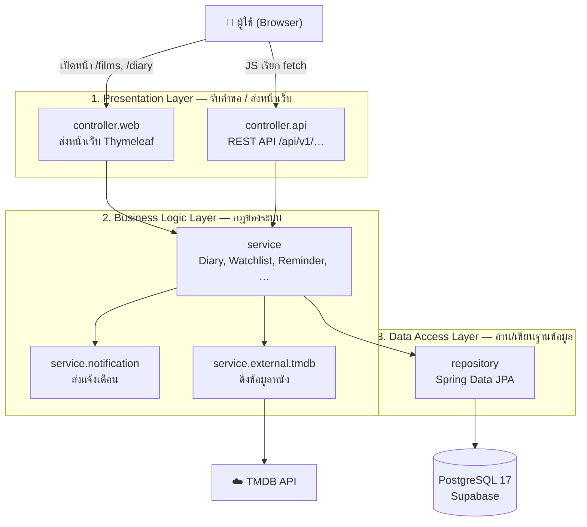

# Poppy Night — Cinema Log & Release Radar

เว็บแอปบันทึกการดูหนังในสไตล์สมุดวาดมือ ผู้ใช้ค้นหาหนัง (ข้อมูลจาก TMDB) บันทึกว่าดูเรื่องไหน ให้ดาวและเขียนรีวิว ดูไดอารี่เป็นปฏิทิน
จัดเก็บ watchlist, หนังที่ชอบ และคอลเลกชันส่วนตัว และตั้งเตือนวันหนังเข้าฉายให้แจ้งเตือนในเว็บหรือทางอีเมล
พัฒนาด้วย Spring Boot แบบ Layered Architecture ใช้หลัก SOLID และ GoF Design Patterns ฐานข้อมูล PostgreSQL และหน้าเว็บ Thymeleaf
สำหรับรายวิชา CP353002 Principles of Software Design and Development (Section 03)

## สมาชิกกลุ่ม

| ลำดับ | ชื่อ-นามสกุล | รหัสนักศึกษา | Section | Branch | หน้าที่รับผิดชอบ |
|---|---|---|---|---|---|
| 1 | นางสาวนันทพร ลุนทอง | 673380409-0 | 03 | `Nunthaporn_673380409-0_03` | ไดอารี่ (CRUD), watchlist, likes, คอลเลกชัน (CRUD), รีวิว, สถิติคลังหนัง; หน้า Diary / Library / Collections; ER Diagram, Domain Model, Activity Diagram และ Data Dictionary |
| 2 | นางสาวปรายฝน ฮกเซ็ง | 673380591-5 | 03 | `Prayfon_673380591-5_03` | ข้อมูลหนังและเชื่อม TMDB (Adapter), ค้นหา/กรองพร้อม pagination (Builder), แนะนำหนัง, sync อัตโนมัติ; หน้า Films / Catalog / Movie และ design system; Class และ Sequence Diagram |
| 3 | นางสาวปวริศา สีดาชมภู | 673380592-3 | 03 | `Pawarisa_673380592-3_03` | ตั้งค่าโปรเจกต์, Security และ Login, โปรไฟล์, เตือนวันเข้าฉาย (State), การแจ้งเตือน (Strategy, Template Method, Factory, Observer), error handling, layout; Docker / CI / Deploy; Use Case, Component/Deployment และ State Diagram |

## Tech Stack

| Layer | Technology |
|---|---|
| Backend | Java 17, Spring Boot 4.1 (Web MVC, Data JPA, Validation, Security, Mail, Actuator) — generated with Spring Initializr |
| Database | PostgreSQL (Supabase, version 17), Flyway migrations V1–V8 |
| Frontend | Thymeleaf templates + vanilla ES modules (no build step) |
| API docs | springdoc-openapi → `/swagger-ui.html` |
| External API | TMDB v3 |
| Tests | JUnit 5, Mockito, Spring Boot Test (`@WebMvcTest`), JaCoCo |
| Delivery | Docker, docker-compose, GitHub Actions, Render + Supabase (PostgreSQL) |

## System Architecture

ระบบเป็นแอป Spring Boot ตัวเดียว ทั้งหน้าเว็บและ API อยู่ในแอปเดียวกัน โค้ดแบ่งเป็นชั้น (Layered Architecture) คำขอจากผู้ใช้จะเดินลงทีละชั้นจากบนลงล่าง และไม่มีการข้ามชั้น เช่น Controller จะไม่เรียก Repository ตรง ๆ แต่ต้องผ่าน Service ก่อนเสมอ



| ชั้น | แพ็กเกจ | หน้าที่ |
|---|---|---|
| Presentation | `controller.web`, `controller.api` | รับคำขอจากผู้ใช้ ตรวจข้อมูลที่ส่งมา แล้วส่งหน้าเว็บหรือ JSON กลับไป |
| Business Logic | `service`, `service.impl`, `service.notification`, `service.external.tmdb` | กฎของระบบ เช่น ห้ามบันทึกวันดูในอนาคต ตั้งเตือนได้เฉพาะหนังที่ยังไม่ฉาย ส่งแจ้งเตือน ดึงข้อมูลจาก TMDB |
| Data Access | `repository` | อ่านและบันทึกข้อมูลลงฐานข้อมูลผ่าน Spring Data JPA |
| ข้อมูลที่ใช้ร่วมกัน | `domain` (entity, enum, event), `dto`, `mapper` | รูปแบบข้อมูลที่ทุกชั้นใช้ร่วมกัน entity ไม่ถูกส่งออกไปนอก service แต่จะแปลงเป็น DTO ก่อน |

**ตัวอย่างการทำงาน: กดบันทึกว่าดูหนังแล้ว**
1. JS ในหน้าเว็บส่ง `POST /api/v1/users/me/diary` ไปที่ `DiaryController` (Presentation)
2. `DiaryServiceImpl` ตรวจกฎ เช่น วันที่ต้องไม่อยู่ในอนาคต แล้วสั่งบันทึก (Business Logic)
3. `WatchedMovieRepository` บันทึกลงตารางในฐานข้อมูล (Data Access)
4. Service ประกาศ event ว่ามีการบันทึกใหม่ แล้ว `NotificationEventListener` สร้างแจ้งเตือนให้ (Observer pattern)

รายละเอียดเพิ่มเติม: [Class diagram](doc/diagrams/03-class-diagram.md) · [Component & Deployment](doc/diagrams/07-component-deployment.md) · [Design patterns](doc/design-patterns.md) · [SOLID](doc/solid-analysis.md)

## Database Design (ER Diagram)

มี 13 ตาราง ครบทั้ง One-to-One, One-to-Many และ Many-to-Many

13 tables. One-to-One: `users`–`user_profiles`. One-to-Many: `users`→`watched_movies`, `collections`, `reminders`, `notifications`. Many-to-Many: `movies`–`genres`, `user_profiles`–`genres`, `collections`–`movies` (through `collection_movies` with `added_at`).
Diagram: [`doc/diagrams/06-er-diagram.md`](doc/diagrams/06-er-diagram.md) · columns, keys, indexes, cascades: [`doc/data-dictionary.md`](doc/data-dictionary.md).

## Installation & Setup

สิ่งที่ต้องมีและการตั้งค่าก่อนรัน (ห้าม commit ไฟล์ `.env` ที่มีรหัสจริง)

Requirements: JDK 17+, Maven 3.9+ (or IntelliJ IDEA's built-in Maven), PostgreSQL 16 **or** Docker Desktop, a TMDB API key.

1. Create the local database (skip if you use docker-compose):
   ```sql
   CREATE USER cinemalog WITH PASSWORD 'cinemalog';
   CREATE DATABASE cinemalog OWNER cinemalog;
   ```
   Flyway creates every table and the demo data on first start.
2. Set environment variables (copy `.env.example`; never commit real keys):
   ```
   TMDB_API_KEY=your-key            # v3 API key or v4 read token
   DB_URL=jdbc:postgresql://localhost:5432/cinemalog
   DB_USERNAME=cinemalog
   DB_PASSWORD=cinemalog
   ```
   Without `TMDB_API_KEY` the app still runs on the 39 seeded movies.

## How to Run

รันได้ 2 แบบ: ทั้งหมดผ่าน Docker หรือรันกับ PostgreSQL ในเครื่อง

```bash
# option A: everything in Docker
docker compose up --build

# option B: local PostgreSQL
cd code
mvn spring-boot:run
```
Open http://localhost:8080 and create an account at `/register`. The demo accounts (`demo@cinemalog.app` and friends) use a password the team shares privately with the instructor.

## API Documentation

เอกสาร API ดูได้ที่ Swagger UI (ต้อง login ที่ `/login` ก่อน)

Swagger UI: `/swagger-ui.html` (log in through `/login` first; Swagger reuses the session). OpenAPI JSON: `/v3/api-docs`.

| Resource | Endpoints |
|---|---|
| Auth | `POST /api/v1/auth/register` |
| Profile | `GET, PUT /api/v1/users/me` · `PUT /api/v1/users/me/favorite-genres` |
| Movies | `GET /api/v1/movies` (search, filters, **pagination & sorting**) · `GET /{id}` · `/{id}/similar` · `/now-showing` · `/upcoming` · `/top-rated` · `/recommended` · `GET /api/v1/genres` |
| Reviews | `GET /api/v1/movies/{movieId}/reviews` |
| **Diary (CRUD)** | `GET /api/v1/users/me/diary` (paged, `sort=`) · `/calendar?month=YYYY-MM` · `/day?date=` · `GET/PUT/DELETE /{id}` · `POST` (201 + Location) |
| **Collections (CRUD)** | `GET, POST /api/v1/users/me/collections` · `GET, PUT, DELETE /{id}` · `PUT, DELETE /{id}/movies/{movieId}` |
| Watchlist / Likes | `GET /api/v1/users/me/watchlist` · `PUT, DELETE /{movieId}` (same for `/likes`) |
| Reminders | `GET /api/v1/users/me/reminders` · `PUT, DELETE /{movieId}` |
| Notifications | `GET /api/v1/users/me/notifications` · `/unread-count` · `POST /read-all` |
| Library | `GET /api/v1/users/me/library` · `GET /api/v1/users/me/stats` |

Errors always use one JSON shape (`GlobalExceptionHandler`):
```json
{ "timestamp": "…", "status": 400, "error": "Bad Request", "message": "Some fields are not valid.",
  "path": "/api/v1/users/me/collections", "fieldErrors": [ { "field": "name", "message": "Give your collection a name" } ] }
```
Status codes used: 200, 201, 204, 400, 401, 404, 409, 500, 503.

## How to Run Tests

เทสทั้งหมดอยู่ในโฟลเดอร์ `test/` (JUnit 5 + Mockito) ไม่ต้องต่อฐานข้อมูล

```bash
cd code
mvn verify                              # runs all tests in ../test + JaCoCo coverage
mvn surefire-report:report-only         # HTML report
```
Reports: `code/target/reports/surefire.html` (tests), `code/target/site/jacoco/index.html` (coverage). Copy them to `test/reports/` before submission.

## Deployment URL

เว็บที่ deploy จริง (Render + Supabase)

- App: `https://<your-service>.onrender.com` ← fill in after deploying
- Swagger: `https://<your-service>.onrender.com/swagger-ui.html`

Render: New → Web Service → this repo → Docker (uses the root `Dockerfile`). Set `DB_URL` (Supabase → Connect → Session pooler, port 5432: `jdbc:postgresql://<host>.pooler.supabase.com:5432/postgres?sslmode=require`), `DB_USERNAME` (`postgres.<project-ref>`), `DB_PASSWORD`, `TMDB_API_KEY`. Add the Render deploy hook as the GitHub secret `RENDER_DEPLOY_HOOK` to deploy automatically after CI passes on `main`.

## Project Structure

```
├── code/                      Spring Boot application
│   ├── pom.xml
│   └── src/main/
│       ├── java/com/cinemalog/
│       │   ├── config/        Security, OpenAPI, Clock, TMDB client
│       │   ├── controller/api REST controllers (/api/v1)
│       │   ├── controller/web Thymeleaf page controllers
│       │   ├── service/       interfaces, impl/, notification/, external/tmdb/, job/
│       │   ├── repository/    Spring Data JPA + specification/
│       │   ├── domain/        entity/, enums/, event/, model/
│       │   ├── dto/           request/, response/, external/tmdb/
│       │   ├── mapper/        entity → DTO
│       │   ├── exception/     ApiException family + GlobalExceptionHandler
│       │   ├── security/      login principal, onboarding redirect
│       │   └── common/        CurrentUserProvider
│       └── resources/
│           ├── db/migration/  Flyway V1–V8
│           ├── templates/     Thymeleaf views
│           └── static/        css/, js/ (core, api, components, pages), img/
├── test/                      JUnit 5 + Mockito tests (Maven reads them from here)
├── doc/                       solid-analysis.md, design-patterns.md, data-dictionary.md, diagrams/, slide/
├── img/                       logo and mascot SVGs
├── Dockerfile · docker-compose.yml · .github/workflows/ci.yml
```

This product uses the TMDB API but is not endorsed or certified by TMDB.
