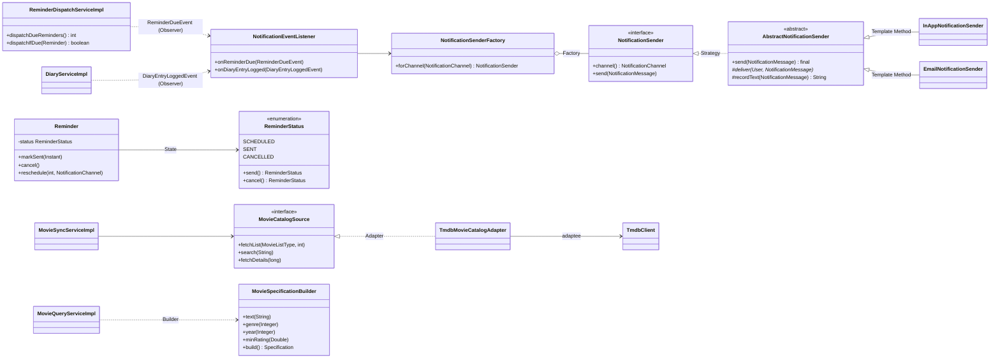

# Design patterns

Chosen GoF group: **Behavioral** (Strategy, Observer, Template Method, State).
We also use one Creational (Factory, Builder) and one Structural (Adapter) pattern where they solve a real problem.
Every row below points at the class that uses the pattern.

## 5.1 Enterprise / architectural patterns (required)

| Pattern | Problem it solves | Files / classes |
|---|---|---|
| Layered Architecture | Keeps HTTP, business rules and data access apart; no layer is skipped | `controller/*` → `service/*` → `repository/*` → `domain/*` |
| MVC | Pages are rendered by Thymeleaf views from controllers | `controller/web/*PageController`, `templates/**`, model = DTOs |
| Repository | Data access without SQL in services | `repository/*Repository` (Spring Data JPA), `MovieRepository` + `JpaSpecificationExecutor` |
| Service Layer | One place for business rules and transactions | `service/*Service` interfaces + `service/impl/*` (`@Transactional`) |
| DTO + Mapper | Entities never leave the service layer; the API contract stays stable | `dto/request`, `dto/response`, `mapper/*Mapper` |
| Dependency Injection | Classes get collaborators through constructors only | every `@Service`, `@Component`, `@RestController` |

## 5.2 GoF patterns

| Pattern | Group | Problem it solves | Files / classes | Owner |
|---|---|---|---|---|
| **Strategy** | Behavioral | Reminders can go out in-app or by email; the caller shouldn't care which | `NotificationSender` (strategy), `InAppNotificationSender`, `EmailNotificationSender` | Pawarisa |
| **Observer** | Behavioral | When a reminder is due or a review is saved, notifications must be created without the reminder/diary code depending on notifications | `ReminderDispatchServiceImpl` and `DiaryServiceImpl` publish `ReminderDueEvent` / `DiaryEntryLoggedEvent`; `NotificationEventListener` subscribes (`@EventListener`) | Pawarisa (+ Nunthaporn publishes) |
| **Template Method** | Behavioral | Every channel follows the same steps (load user → deliver → save record) but delivery differs | `AbstractNotificationSender.send()` is `final`; subclasses implement `deliver()` and may override `recordText()` | Pawarisa |
| **State** | Behavioral | A reminder can be SCHEDULED, SENT or CANCELLED; which actions are allowed depends on the state | `ReminderStatus` enum (each constant implements `send()`), used by `Reminder.markSent()` / `cancel()` / `reschedule()` | Pawarisa |
| **Factory** | Creational | Pick the right sender for a channel without `if/else` | `NotificationSenderFactory.forChannel()` | Pawarisa |
| **Builder** | Creational | The catalog has 7 optional filters; building the query with nested ifs was unreadable | `MovieSpecificationBuilder` (`text().genre().year()… .build()`), used in `MovieQueryServiceImpl.search()` | Prayfon |
| **Adapter** | Structural | TMDB's JSON (snake_case, string dates, credits lists) must not leak into our model | `MovieCatalogSource` (target) ← `TmdbMovieCatalogAdapter` (adapter) → `TmdbClient` (adaptee) | Prayfon |
| **Singleton** | Creational | One shared `Clock`, `RestClient` and `PasswordEncoder` | `@Bean` methods in `ClockConfig`, `TmdbClientConfig`, `SecurityConfig` (Spring singleton scope) | Pawarisa / Prayfon |

## Class diagram (pattern positions)

