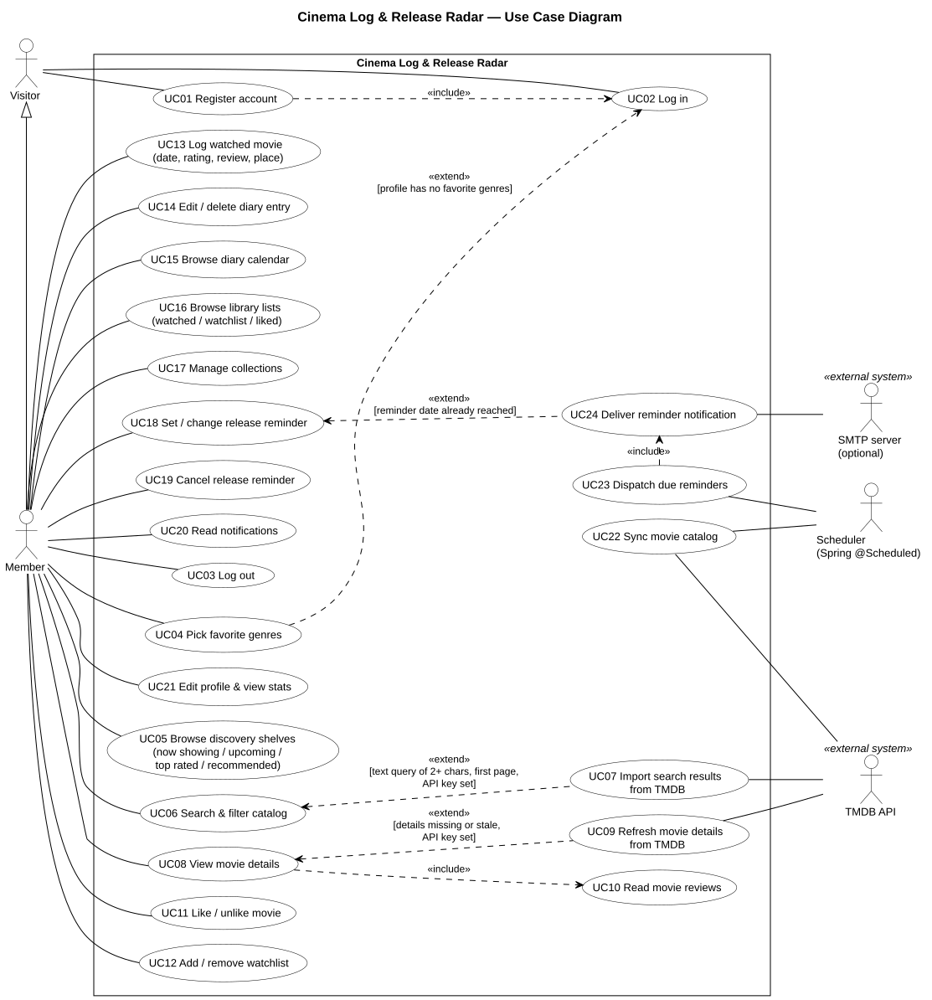

# Use case diagram และคำอธิบาย Use Case

UML use case diagram (PlantUML) ไฟล์ต้นฉบับ: [`01-use-case.puml`](01-use-case.puml) · ภาพที่ render แล้ว: [`01-use-case.svg`](01-use-case.svg) · เอกสาร A4 สำหรับพิมพ์ (แผนภาพ + ตารางคำอธิบาย): [`01-use-case.pdf`](01-use-case.pdf)

## Actor

- **Visitor**: ผู้ที่ยังไม่ได้ล็อกอิน เข้าได้เฉพาะ `/login`, `/register` และ public API (`SecurityConfig`)
- **Member**: Visitor ที่ล็อกอินแล้ว (generalization) ทุกหน้าและ `/api/v1/users/me/**` ต้องมี session
- **Scheduler**: งาน Spring `@Scheduled` คือ `MovieSyncJob` และ `ReminderJob` แต่ละงานจะรันหนึ่งครั้งตอน `ApplicationReadyEvent` ด้วย
- **TMDB API, SMTP server**: ระบบภายนอก การส่งอีเมลเป็นตัวเลือกเสริม (`spring.mail.host` ปล่อยว่างได้)

## ความสัมพันธ์ «include» / «extend» ที่ใช้ในแผนภาพ

| ความสัมพันธ์ (Relation) | เหตุผล | โค้ดที่เกี่ยวข้อง |
|---|---|---|
| UC01 «include» UC02 | หลังสมัครสมาชิกสำเร็จ หน้าเว็บจะส่งฟอร์มล็อกอินที่ซ่อนไว้ทุกครั้ง | `templates/auth/register.html` (`#auto-login`), `pages/auth.js` |
| UC04 «extend» UC02 | เฉพาะเมื่อโปรไฟล์ยังไม่มีแนวหนังที่ชอบ | `OnboardingAwareSuccessHandler` → `UserProfileService.needsOnboarding()` |
| UC07 «extend» UC06 | เฉพาะการค้นหาด้วยข้อความยาว 2 ตัวอักษรขึ้นไป ที่หน้า 0 และมี TMDB key | `MovieQueryServiceImpl.search()` → `MovieSyncService.importSearchResults()` |
| UC08 «include» UC10 | หน้าหนังจะโหลดรีวิวของหนังเรื่องนั้นทุกครั้ง | `pages/movie.js` → `GET /api/v1/movies/{id}/reviews` |
| UC09 «extend» UC08 | เฉพาะเมื่อรายละเอียดยังไม่มีหรือเก่าเกินไป และตั้งค่า key แล้ว | `MovieQueryServiceImpl.getDetail()` → `Movie.needsDetails()` → `refreshDetails()` |
| UC23 «include» UC24 | การเตือนทุกรายการที่ถึงกำหนดจะถูกส่ง | `ReminderDispatchServiceImpl.dispatchDueReminders()` |
| UC24 «extend» UC18 | เฉพาะเมื่อถึงวันเตือนแล้ว | `ReminderServiceImpl.save()` → `dispatchIfDue()` |

## คำอธิบาย Use Case

### UC01 — Register account (สมัครสมาชิก)

| หัวข้อ | รายละเอียด |
|---|---|
| รหัส (Use Case ID) | UC01 |
| ชื่อ Use Case | Register account (สมัครสมาชิก) |
| Actor หลัก | Visitor |
| คำอธิบาย | ผู้เยี่ยมชมสร้างบัญชีใหม่ และระบบล็อกอินให้ทันที |
| เงื่อนไขก่อนเริ่ม (Pre-conditions) | • ยังไม่ได้ล็อกอิน |
| ผลลัพธ์หลังจบ (Post-conditions) | • มีแถวใน `users` + `user_profiles` และเก็บรหัสผ่านเป็น BCrypt hash |
| ขั้นตอนหลัก (Main Flow) | 1. ผู้เยี่ยมชมกรอกชื่อที่แสดง อีเมล และรหัสผ่าน 2. หน้าเว็บส่ง `POST /api/v1/auth/register` 3. ระบบสร้างบัญชีและโปรไฟล์ 4. หน้าเว็บล็อกอินให้ผู้เยี่ยมชมโดยอัตโนมัติ (UC02) |
| ขั้นตอนทางเลือก (Alternative Flow) | • อีเมลนี้ถูกใช้แล้ว → 409 • ไม่กรอกชื่อ อีเมลไม่ถูกต้อง หรือรหัสผ่านไม่ได้ยาว 6–72 ตัวอักษร → 400 พร้อม `fieldErrors` |

### UC02 — Log in (เข้าสู่ระบบ)

| หัวข้อ | รายละเอียด |
|---|---|
| รหัส (Use Case ID) | UC02 |
| ชื่อ Use Case | Log in (เข้าสู่ระบบ) |
| Actor หลัก | Visitor |
| คำอธิบาย | ผู้เยี่ยมชมเข้าสู่ระบบด้วยอีเมลและรหัสผ่าน แล้วได้ session |
| เงื่อนไขก่อนเริ่ม (Pre-conditions) | • มีบัญชีอยู่แล้ว |
| ผลลัพธ์หลังจบ (Post-conditions) | • ตั้งค่า session cookie แล้ว |
| ขั้นตอนหลัก (Main Flow) | 1. ผู้เยี่ยมชมส่งอีเมล + รหัสผ่านไปที่ `/login` 2. ระบบสร้าง session 3. ระบบพาไปที่ `/films` |
| ขั้นตอนทางเลือก (Alternative Flow) | • อีเมลหรือรหัสผ่านผิด → `/login?error` • ยังไม่มีแนวหนังที่ชอบ → `/onboarding` (UC04) |

### UC03 — Log out (ออกจากระบบ)

| หัวข้อ | รายละเอียด |
|---|---|
| รหัส (Use Case ID) | UC03 |
| ชื่อ Use Case | Log out (ออกจากระบบ) |
| Actor หลัก | Member |
| คำอธิบาย | สมาชิกจบ session ปัจจุบัน |
| เงื่อนไขก่อนเริ่ม (Pre-conditions) | • ล็อกอินอยู่ |
| ผลลัพธ์หลังจบ (Post-conditions) | • session สิ้นสุด และพาไปที่ `/login?logout` |
| ขั้นตอนหลัก (Main Flow) | 1. สมาชิกเปิดเมนูนำทางแล้วเลือกออกจากระบบ (`POST /logout`) |
| ขั้นตอนทางเลือก (Alternative Flow) | — |

### UC04 — Pick favorite genres (เลือกแนวหนังที่ชอบ)

| หัวข้อ | รายละเอียด |
|---|---|
| รหัส (Use Case ID) | UC04 |
| ชื่อ Use Case | Pick favorite genres (เลือกแนวหนังที่ชอบ) |
| Actor หลัก | Member |
| คำอธิบาย | สมาชิกเลือกแนวหนังที่ระบบจะใช้แนะนำหนัง |
| เงื่อนไขก่อนเริ่ม (Pre-conditions) | • ล็อกอินอยู่ |
| ผลลัพธ์หลังจบ (Post-conditions) | • ข้อมูลใน `user_favorite_genres` ถูกแทนที่ด้วยชุดใหม่ |
| ขั้นตอนหลัก (Main Flow) | 1. สมาชิกติ๊กเลือกแนวหนัง 2. หน้าเว็บส่ง `PUT /api/v1/users/me/favorite-genres` |
| ขั้นตอนทางเลือก (Alternative Flow) | • ไม่ได้ติ๊กเลย → 400 "Pick at least one genre" • เลือกเกิน 10 แนว → 400 |

### UC05 — Browse discovery shelves (ดูชั้นหนังหน้าแรก)

| หัวข้อ | รายละเอียด |
|---|---|
| รหัส (Use Case ID) | UC05 |
| ชื่อ Use Case | Browse discovery shelves (ดูชั้นหนังหน้าแรก) |
| Actor หลัก | Member |
| คำอธิบาย | สมาชิกดูชั้นหนังต่าง ๆ ในหน้าแรก |
| เงื่อนไขก่อนเริ่ม (Pre-conditions) | • ล็อกอินอยู่ |
| ผลลัพธ์หลังจบ (Post-conditions) | — |
| ขั้นตอนหลัก (Main Flow) | 1. สมาชิกเปิด `/films` 2. ระบบแสดงหนังที่กำลังฉาย หนังที่จะเข้าฉาย หนังคะแนนสูงสุด และหนังแนะนำ (`/api/v1/movies/now-showing`, `/upcoming`, `/top-rated`, `/recommended`) |
| ขั้นตอนทางเลือก (Alternative Flow) | • ยังไม่มีแนวหนังที่ชอบ → หนังแนะนำจะใช้รายการหนังคะแนนสูงสุดแทน |

### UC06 — Search & filter catalog (ค้นหาและกรองหนัง)

| หัวข้อ | รายละเอียด |
|---|---|
| รหัส (Use Case ID) | UC06 |
| ชื่อ Use Case | Search & filter catalog (ค้นหาและกรองหนัง) |
| Actor หลัก | Member |
| คำอธิบาย | สมาชิกค้นหาหนังในคลังด้วยข้อความและตัวกรอง |
| เงื่อนไขก่อนเริ่ม (Pre-conditions) | • ล็อกอินอยู่ |
| ผลลัพธ์หลังจบ (Post-conditions) | — |
| ขั้นตอนหลัก (Main Flow) | 1. สมาชิกกำหนดข้อความ แนวหนัง ปี ทศวรรษ ฉายก่อนวันที่ คะแนนขั้นต่ำ ภาษา และการเรียงลำดับ 2. หน้าเว็บส่ง `GET /api/v1/movies` 3. ระบบส่งผลลัพธ์กลับมาหน้าละ 40 รายการ |
| ขั้นตอนทางเลือก (Alternative Flow) | • ไม่พบหนังที่ตรงเงื่อนไข → แสดงหน้าว่าง • TMDB มีข้อผิดพลาด → แสดงเฉพาะผลจากฐานข้อมูลในระบบ (บันทึก warning ไว้ใน log) |

### UC07 — Import search results from TMDB (นำเข้าผลการค้นหาจาก TMDB)

| หัวข้อ | รายละเอียด |
|---|---|
| รหัส (Use Case ID) | UC07 |
| ชื่อ Use Case | Import search results from TMDB (นำเข้าผลการค้นหาจาก TMDB) |
| Actor หลัก | System (ขยายจาก UC06) |
| คำอธิบาย | ระหว่างการค้นหา ระบบนำเข้าหนังที่ตรงกับคำค้นจาก TMDB |
| เงื่อนไขก่อนเริ่ม (Pre-conditions) | • ค้นหาด้วยข้อความยาว 2 ตัวอักษรขึ้นไป (`MovieSearchCriteria.hasText()`) อยู่ที่หน้า 0 และตั้งค่า TMDB key แล้ว |
| ผลลัพธ์หลังจบ (Post-conditions) | • มีแถวใน `movies` ที่เพิ่มใหม่หรือถูกอัปเดต |
| ขั้นตอนหลัก (Main Flow) | 1. ระบบเรียก `TmdbMovieCatalogAdapter.search()` 2. ระบบ upsert หนังที่พบโดยใช้ `tmdb_id` |
| ขั้นตอนทางเลือก (Alternative Flow) | • ติดต่อ TMDB ไม่ได้ → ดักจับ `ExternalServiceException` ไว้ แล้วค้นหาต่อตามปกติ |

### UC08 — View movie details (ดูรายละเอียดหนัง)

| หัวข้อ | รายละเอียด |
|---|---|
| รหัส (Use Case ID) | UC08 |
| ชื่อ Use Case | View movie details (ดูรายละเอียดหนัง) |
| Actor หลัก | Member |
| คำอธิบาย | สมาชิกเปิดหน้าหนังที่มีรายละเอียดและปุ่มต่าง ๆ |
| เงื่อนไขก่อนเริ่ม (Pre-conditions) | • ล็อกอินอยู่ |
| ผลลัพธ์หลังจบ (Post-conditions) | — |
| ขั้นตอนหลัก (Main Flow) | 1. สมาชิกเปิด `/movies/{id}` 2. ระบบแสดงรายละเอียด นักแสดง รีวิว (UC10) และหนังที่คล้ายกัน 3. หน้าเว็บแสดงปุ่มกดถูกใจ watchlist ดูแล้ว ให้คะแนน รีวิว ตั้งเตือน และ collection |
| ขั้นตอนทางเลือก (Alternative Flow) | • ไม่พบ id นี้ → 404 • หนังยังไม่เข้าฉาย → ปุ่มดูแล้ว/ให้คะแนน/รีวิวใช้ไม่ได้ แต่ปุ่มตั้งเตือนใช้ได้ |

### UC09 — Refresh movie details from TMDB (อัปเดตรายละเอียดหนังจาก TMDB)

| หัวข้อ | รายละเอียด |
|---|---|
| รหัส (Use Case ID) | UC09 |
| ชื่อ Use Case | Refresh movie details from TMDB (อัปเดตรายละเอียดหนังจาก TMDB) |
| Actor หลัก | System (ขยายจาก UC08) |
| คำอธิบาย | เมื่อรายละเอียดหนังยังไม่มีหรือเก่าเกินไป ระบบจะดึงข้อมูลใหม่จาก TMDB |
| เงื่อนไขก่อนเริ่ม (Pre-conditions) | • รายละเอียดยังไม่มีหรือเก่าเกินไป และตั้งค่า TMDB key แล้ว |
| ผลลัพธ์หลังจบ (Post-conditions) | • `details_fetched_at` ถูกอัปเดต |
| ขั้นตอนหลัก (Main Flow) | 1. ระบบเรียก `MovieSyncService.refreshDetails()` 2. ระบบอัปเดตความยาวหนัง ผู้กำกับ นักแสดง และแนวหนัง |
| ขั้นตอนทางเลือก (Alternative Flow) | • TMDB มีข้อผิดพลาด → แสดงข้อมูลเดิม |

### UC10 — Read movie reviews (อ่านรีวิวหนัง)

| หัวข้อ | รายละเอียด |
|---|---|
| รหัส (Use Case ID) | UC10 |
| ชื่อ Use Case | Read movie reviews (อ่านรีวิวหนัง) |
| Actor หลัก | Member |
| คำอธิบาย | สมาชิกอ่านรีวิวของหนังเรื่องหนึ่ง |
| เงื่อนไขก่อนเริ่ม (Pre-conditions) | • มีหนังเรื่องนี้อยู่ในระบบ |
| ผลลัพธ์หลังจบ (Post-conditions) | — |
| ขั้นตอนหลัก (Main Flow) | 1. หน้าเว็บส่ง `GET /api/v1/movies/{id}/reviews` 2. ระบบส่งคะแนนเฉลี่ยและรีวิวกลับมา โดยรีวิวของตัวเองอยู่บนสุด |
| ขั้นตอนทางเลือก (Alternative Flow) | • ไม่พบหนังเรื่องนี้ → 404 |

### UC11 — Like / unlike movie (กดถูกใจ / ยกเลิกถูกใจหนัง)

| หัวข้อ | รายละเอียด |
|---|---|
| รหัส (Use Case ID) | UC11 |
| ชื่อ Use Case | Like / unlike movie (กดถูกใจ / ยกเลิกถูกใจหนัง) |
| Actor หลัก | Member |
| คำอธิบาย | สมาชิกกดถูกใจหรือยกเลิกถูกใจหนัง |
| เงื่อนไขก่อนเริ่ม (Pre-conditions) | • ล็อกอินอยู่ |
| ผลลัพธ์หลังจบ (Post-conditions) | • เพิ่มหรือลบแถวใน `liked_movies` |
| ขั้นตอนหลัก (Main Flow) | 1. สมาชิกกด ♡ → `PUT /api/v1/users/me/likes/{movieId}` ถ้ากดซ้ำ → `DELETE` |
| ขั้นตอนทางเลือก (Alternative Flow) | • ถูกใจไว้แล้ว → ไม่มีอะไรเปลี่ยน • ไม่พบหนังเรื่องนี้ → 404 |

### UC12 — Add / remove watchlist (เพิ่ม / ลบ watchlist)

| หัวข้อ | รายละเอียด |
|---|---|
| รหัส (Use Case ID) | UC12 |
| ชื่อ Use Case | Add / remove watchlist (เพิ่ม / ลบ watchlist) |
| Actor หลัก | Member |
| คำอธิบาย | สมาชิกเพิ่มหนังเข้า watchlist หรือลบออกจาก watchlist |
| เงื่อนไขก่อนเริ่ม (Pre-conditions) | • ล็อกอินอยู่ |
| ผลลัพธ์หลังจบ (Post-conditions) | • เพิ่มหรือลบแถวใน `watchlist_items` |
| ขั้นตอนหลัก (Main Flow) | 1. สมาชิกกด + → `PUT /api/v1/users/me/watchlist/{movieId}` ถ้าลบ → `DELETE` |
| ขั้นตอนทางเลือก (Alternative Flow) | • อยู่ในรายการแล้ว → ไม่มีอะไรเปลี่ยน • ไม่พบหนังเรื่องนี้ → 404 |

### UC13 — Log watched movie (บันทึกหนังที่ดูแล้ว)

| หัวข้อ | รายละเอียด |
|---|---|
| รหัส (Use Case ID) | UC13 |
| ชื่อ Use Case | Log watched movie (บันทึกหนังที่ดูแล้ว) |
| Actor หลัก | Member |
| คำอธิบาย | สมาชิกบันทึกว่าดูหนังเรื่องหนึ่งแล้ว จะให้คะแนนและเขียนรีวิวด้วยก็ได้ |
| เงื่อนไขก่อนเริ่ม (Pre-conditions) | • ล็อกอินอยู่ และหนังเข้าฉายแล้ว |
| ผลลัพธ์หลังจบ (Post-conditions) | • เพิ่มแถวใน `watched_movies` และเอาหนังออกจาก watchlist ถ้ามีการเขียนรีวิว จะมีการแจ้งเตือนในแอปว่า "review added" |
| ขั้นตอนหลัก (Main Flow) | 1. สมาชิกเลือกวันที่ จำนวนดาว รีวิว และสถานที่ดู 2. หน้าเว็บส่ง `POST /api/v1/users/me/diary` |
| ขั้นตอนทางเลือก (Alternative Flow) | • วันที่อยู่ในอนาคต หรือหนังยังไม่เข้าฉาย → 400 • คะแนนไม่อยู่ในช่วง 1–5 → 400 • ไม่พบหนังเรื่องนี้ → 404 |

### UC14 — Edit / delete diary entry (แก้ไข / ลบบันทึกไดอารี)

| หัวข้อ | รายละเอียด |
|---|---|
| รหัส (Use Case ID) | UC14 |
| ชื่อ Use Case | Edit / delete diary entry (แก้ไข / ลบบันทึกไดอารี) |
| Actor หลัก | Member |
| คำอธิบาย | สมาชิกแก้ไขหรือลบบันทึกในไดอารีของตัวเอง |
| เงื่อนไขก่อนเริ่ม (Pre-conditions) | • บันทึกนั้นเป็นของสมาชิกคนนี้ |
| ผลลัพธ์หลังจบ (Post-conditions) | • บันทึกถูกแก้ไข (ถ้าเพิ่มรีวิวครั้งแรก → มีการแจ้งเตือน) หรือถูกลบ |
| ขั้นตอนหลัก (Main Flow) | 1. สมาชิกเลือกแก้ไข → `PUT /api/v1/users/me/diary/{id}` หรือเลือกลบ → `DELETE /api/v1/users/me/diary/{id}` |
| ขั้นตอนทางเลือก (Alternative Flow) | • ใช้กฎเรื่องวันที่เหมือน UC13 • เป็นบันทึกของผู้ใช้คนอื่น → 404 |

### UC15 — Browse diary calendar (ดูปฏิทินไดอารี)

| หัวข้อ | รายละเอียด |
|---|---|
| รหัส (Use Case ID) | UC15 |
| ชื่อ Use Case | Browse diary calendar (ดูปฏิทินไดอารี) |
| Actor หลัก | Member |
| คำอธิบาย | สมาชิกดูไดอารีของตัวเองในรูปแบบปฏิทินรายเดือน |
| เงื่อนไขก่อนเริ่ม (Pre-conditions) | • ล็อกอินอยู่ |
| ผลลัพธ์หลังจบ (Post-conditions) | — |
| ขั้นตอนหลัก (Main Flow) | 1. สมาชิกเปิดตารางรายเดือนที่ `/diary` (`/diary/calendar?month=`) 2. สมาชิกคลิกเลือกวัน (`/diary/day?date=`) |
| ขั้นตอนทางเลือก (Alternative Flow) | • เดือนนั้นไม่มีบันทึก → แสดงหน้าว่าง |

### UC16 — Browse library lists (ดูรายการในคลังของฉัน)

| หัวข้อ | รายละเอียด |
|---|---|
| รหัส (Use Case ID) | UC16 |
| ชื่อ Use Case | Browse library lists (ดูรายการในคลังของฉัน) |
| Actor หลัก | Member |
| คำอธิบาย | สมาชิกดูรายการหนังที่ดูแล้ว watchlist และหนังที่ถูกใจ |
| เงื่อนไขก่อนเริ่ม (Pre-conditions) | • ล็อกอินอยู่ |
| ผลลัพธ์หลังจบ (Post-conditions) | — |
| ขั้นตอนหลัก (Main Flow) | 1. สมาชิกเปิดหน้า `/watched`, `/watchlist` หรือ `/liked` |
| ขั้นตอนทางเลือก (Alternative Flow) | • รายการว่าง → แสดงหน้าว่าง |

### UC17 — Manage collections (จัดการ collection)

| หัวข้อ | รายละเอียด |
|---|---|
| รหัส (Use Case ID) | UC17 |
| ชื่อ Use Case | Manage collections (จัดการ collection) |
| Actor หลัก | Member |
| คำอธิบาย | สมาชิกสร้าง เปลี่ยนชื่อ และลบ collection รวมถึงเพิ่มหรือลบหนังใน collection |
| เงื่อนไขก่อนเริ่ม (Pre-conditions) | • ล็อกอินอยู่ |
| ผลลัพธ์หลังจบ (Post-conditions) | • `collections` / `collection_movies` มีการเปลี่ยนแปลง |
| ขั้นตอนหลัก (Main Flow) | 1. สร้าง เปลี่ยนชื่อ และลบผ่าน `/api/v1/users/me/collections` 2. เพิ่ม/ลบหนังผ่าน `PUT`/`DELETE /{id}/movies/{movieId}` |
| ขั้นตอนทางเลือก (Alternative Flow) | • ชื่อซ้ำ (ไม่สนตัวพิมพ์เล็ก-ใหญ่) → 409 • ไม่กรอกชื่อ → 400 • ลบหนังที่ไม่ได้อยู่ใน collection → 404 |

### UC18 — Set / change release reminder (ตั้ง / เปลี่ยนการเตือนวันเข้าฉาย)

| หัวข้อ | รายละเอียด |
|---|---|
| รหัส (Use Case ID) | UC18 |
| ชื่อ Use Case | Set / change release reminder (ตั้ง / เปลี่ยนการเตือนวันเข้าฉาย) |
| Actor หลัก | Member |
| คำอธิบาย | สมาชิกขอให้ระบบเตือนก่อนหนังที่กำลังจะเข้าฉาย |
| เงื่อนไขก่อนเริ่ม (Pre-conditions) | • หนังยังไม่เข้าฉาย |
| ผลลัพธ์หลังจบ (Post-conditions) | • แถวใน `reminders` มีสถานะ SCHEDULED (หรือ SENT) |
| ขั้นตอนหลัก (Main Flow) | 1. สมาชิกเลือกเตือนล่วงหน้า 7 / 3 / 1 / 0 วัน และเลือกช่องทาง IN_APP หรือ EMAIL 2. หน้าเว็บส่ง `PUT /api/v1/users/me/reminders/{movieId}` |
| ขั้นตอนทางเลือก (Alternative Flow) | • เลือกจำนวนวันอื่น → 400 • ไม่พบหนังเรื่องนี้ → 404 • หนังเข้าฉายแล้วหรือไม่มีวันเข้าฉาย → 400 • มีการเตือนอยู่แล้ว → ตั้งเวลาใหม่ • ถึงวันเตือนแล้ว → ส่งทันที (UC24) |

### UC19 — Cancel release reminder (ยกเลิกการเตือนวันเข้าฉาย)

| หัวข้อ | รายละเอียด |
|---|---|
| รหัส (Use Case ID) | UC19 |
| ชื่อ Use Case | Cancel release reminder (ยกเลิกการเตือนวันเข้าฉาย) |
| Actor หลัก | Member |
| คำอธิบาย | สมาชิกลบการเตือน |
| เงื่อนไขก่อนเริ่ม (Pre-conditions) | • มีการเตือนอยู่ |
| ผลลัพธ์หลังจบ (Post-conditions) | • สถานะเป็น CANCELLED |
| ขั้นตอนหลัก (Main Flow) | 1. หน้าเว็บส่ง `DELETE /api/v1/users/me/reminders/{movieId}` |
| ขั้นตอนทางเลือก (Alternative Flow) | • ไม่มีการเตือน → 404 |

### UC20 — Read notifications (อ่านการแจ้งเตือน)

| หัวข้อ | รายละเอียด |
|---|---|
| รหัส (Use Case ID) | UC20 |
| ชื่อ Use Case | Read notifications (อ่านการแจ้งเตือน) |
| Actor หลัก | Member |
| คำอธิบาย | สมาชิกอ่านการแจ้งเตือนจากเมนูรูปกระดิ่ง |
| เงื่อนไขก่อนเริ่ม (Pre-conditions) | • ล็อกอินอยู่ |
| ผลลัพธ์หลังจบ (Post-conditions) | • การแจ้งเตือนทั้งหมดเป็น `is_read = true` |
| ขั้นตอนหลัก (Main Flow) | 1. กระดิ่งแสดงจำนวนที่ยังไม่อ่าน + 10 รายการล่าสุด 2. เมื่อเปิดกระดิ่งตอนที่มีรายการยังไม่อ่าน → `POST /notifications/read-all` |
| ขั้นตอนทางเลือก (Alternative Flow) | — |

### UC21 — Edit profile & view stats (แก้ไขโปรไฟล์และดูสถิติ)

| หัวข้อ | รายละเอียด |
|---|---|
| รหัส (Use Case ID) | UC21 |
| ชื่อ Use Case | Edit profile & view stats (แก้ไขโปรไฟล์และดูสถิติ) |
| Actor หลัก | Member |
| คำอธิบาย | สมาชิกแก้ไขโปรไฟล์และดูสถิติของตัวเอง |
| เงื่อนไขก่อนเริ่ม (Pre-conditions) | • ล็อกอินอยู่ |
| ผลลัพธ์หลังจบ (Post-conditions) | • `users.email` / `user_profiles` ถูกอัปเดต |
| ขั้นตอนหลัก (Main Flow) | 1. สมาชิกแก้ไขชื่อ อีเมล bio รูปโปรไฟล์ และแนวหนังที่ชอบ → `PUT /api/v1/users/me` 2. หน้าโปรไฟล์แสดงข้อมูลจาก `/api/v1/users/me/stats` |
| ขั้นตอนทางเลือก (Alternative Flow) | • อีเมลถูกใช้โดยบัญชีอื่นแล้ว → 409 • ข้อมูลไม่ถูกต้อง → 400 |

### UC22 — Sync movie catalog (ซิงก์คลังหนัง)

| หัวข้อ | รายละเอียด |
|---|---|
| รหัส (Use Case ID) | UC22 |
| ชื่อ Use Case | Sync movie catalog (ซิงก์คลังหนัง) |
| Actor หลัก | Scheduler |
| คำอธิบาย | งานที่ตั้งเวลาไว้ทำให้คลังหนังในระบบตรงกับ TMDB อยู่เสมอ |
| เงื่อนไขก่อนเริ่ม (Pre-conditions) | • ตั้งค่า TMDB key แล้ว |
| ผลลัพธ์หลังจบ (Post-conditions) | • เพิ่ม `genres` ที่ยังไม่มี (ชื่อเดิมยังคงไว้) และ upsert `movies` กับ `movie_genres` |
| ขั้นตอนหลัก (Main Flow) | 1. `MovieSyncJob` เรียก `syncGenres()` + `syncCatalog()` 2. ระบบดึงหนังที่กำลังฉาย ที่จะเข้าฉาย ยอดนิยม และคะแนนสูงสุด × `sync-pages` หน้า 3. ระบบ upsert หนังโดยใช้ `tmdb_id` |
| ขั้นตอนทางเลือก (Alternative Flow) | • ไม่มี key → ข้ามไปเงียบ ๆ • TMDB มีข้อผิดพลาด → WARN "TMDB sync skipped" |

### UC23 — Dispatch due reminders (ส่งการเตือนที่ถึงกำหนด)

| หัวข้อ | รายละเอียด |
|---|---|
| รหัส (Use Case ID) | UC23 |
| ชื่อ Use Case | Dispatch due reminders (ส่งการเตือนที่ถึงกำหนด) |
| Actor หลัก | Scheduler |
| คำอธิบาย | งานที่ตั้งเวลาไว้ส่งการเตือนทุกรายการที่ถึงวันเตือนแล้ว |
| เงื่อนไขก่อนเริ่ม (Pre-conditions) | — |
| ผลลัพธ์หลังจบ (Post-conditions) | • การเตือนมีสถานะ SENT |
| ขั้นตอนหลัก (Main Flow) | 1. `ReminderJob` เรียก `dispatchDueReminders()` 2. ระบบหาการเตือนสถานะ SCHEDULED ที่วันเตือน ≤ วันนี้ 3. ทำ UC24 กับการเตือนแต่ละรายการ |
| ขั้นตอนทางเลือก (Alternative Flow) | • งานเกิดข้อผิดพลาด → บันทึกลง log |

### UC24 — Deliver reminder notification (ส่งการแจ้งเตือน)

| หัวข้อ | รายละเอียด |
|---|---|
| รหัส (Use Case ID) | UC24 |
| ชื่อ Use Case | Deliver reminder notification (ส่งการแจ้งเตือน) |
| Actor หลัก | System |
| คำอธิบาย | ระบบส่งการเตือนที่ถึงกำหนดหนึ่งรายการผ่านช่องทางที่เลือกไว้ |
| เงื่อนไขก่อนเริ่ม (Pre-conditions) | • การเตือนถึงกำหนดแล้ว |
| ผลลัพธ์หลังจบ (Post-conditions) | • เพิ่มแถวใน `notifications` และการเตือนมีสถานะ SENT |
| ขั้นตอนหลัก (Main Flow) | 1. ระบบ publish `ReminderDueEvent` 2. `NotificationSenderFactory.forChannel()` เลือกตัวส่ง 3. ตัวส่งเรียก `send()` เพื่อส่งการแจ้งเตือน 4. ระบบบันทึกแถวใน `notifications` |
| ขั้นตอนทางเลือก (Alternative Flow) | • เลือก EMAIL แต่ไม่มี mail server → ข้ามการส่งอีเมล (บันทึกลง log) แต่ยังบันทึกข้อมูลไว้ |
