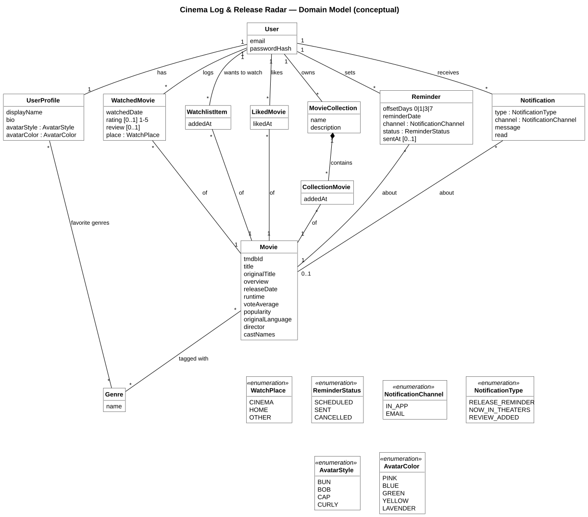

# Domain model (conceptual class diagram)

Conceptual view of the business objects: names, key attributes and multiplicities only.
Technical columns (ids, `created_at`, `updated_at`) are in the ER diagram ([`06-er-diagram.md`](06-er-diagram.md)).
Source of truth: `code/src/main/java/com/cinemalog/domain/entity/*` and `domain/enums/*`.

Source: [`02-domain-model.puml`](02-domain-model.puml) · rendered: [`02-domain-model.svg`](02-domain-model.svg)

Notes
- `CollectionMovie` is its own concept (not a plain many-to-many) because it records **when** a movie was added (`addedAt`).
- A user may log the same movie more than once (rewatches), so `WatchedMovie` has no uniqueness on user + movie. Watchlist, likes, collection items and reminders are unique per user + movie (see ER diagram).
- `NotificationType.NOW_IN_THEATERS` is declared in the enum but no code creates it yet; only `RELEASE_REMINDER` (`NotificationEventListener.onReminderDue`) and `REVIEW_ADDED` (`onDiaryEntryLogged`) are produced.
- `Notification` → `Movie` is optional: the foreign key is nullable and is set to `NULL` if the movie is deleted.
