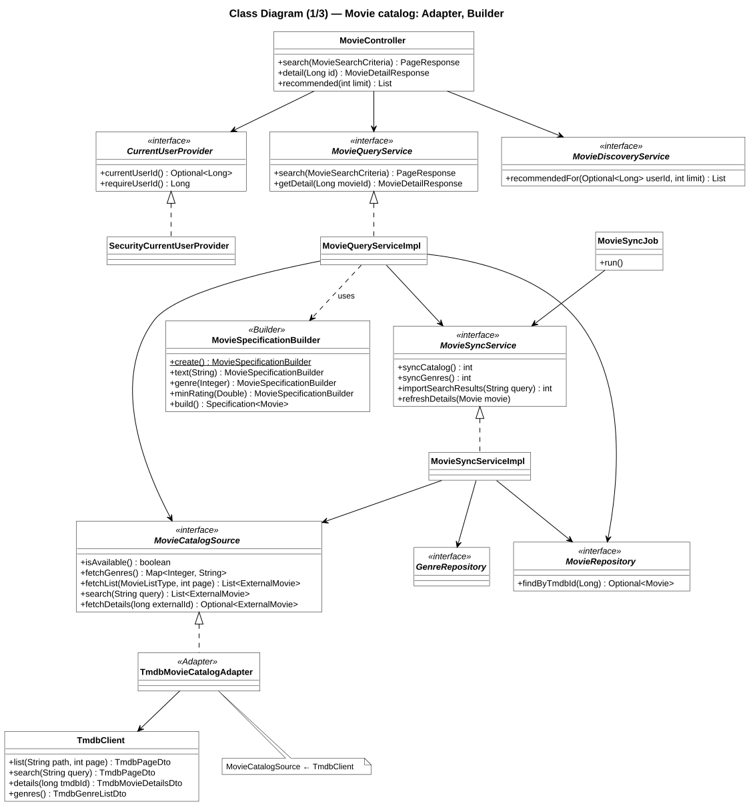
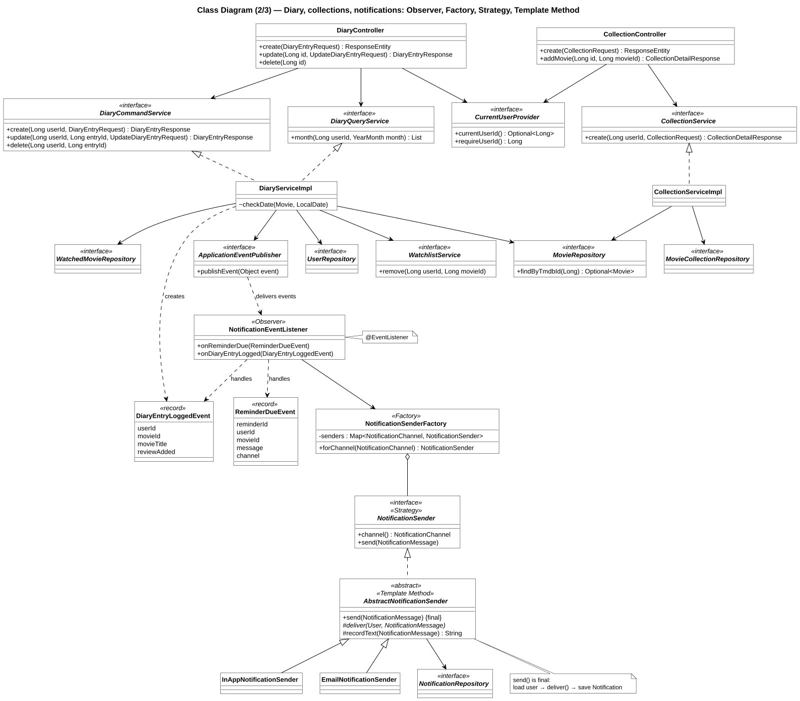
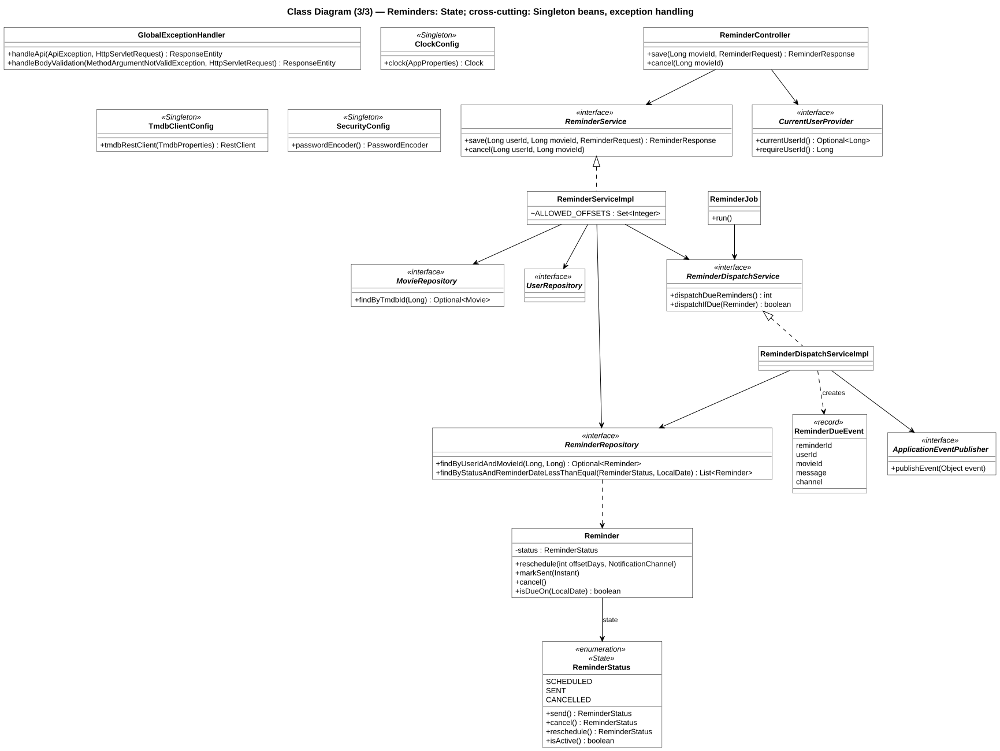
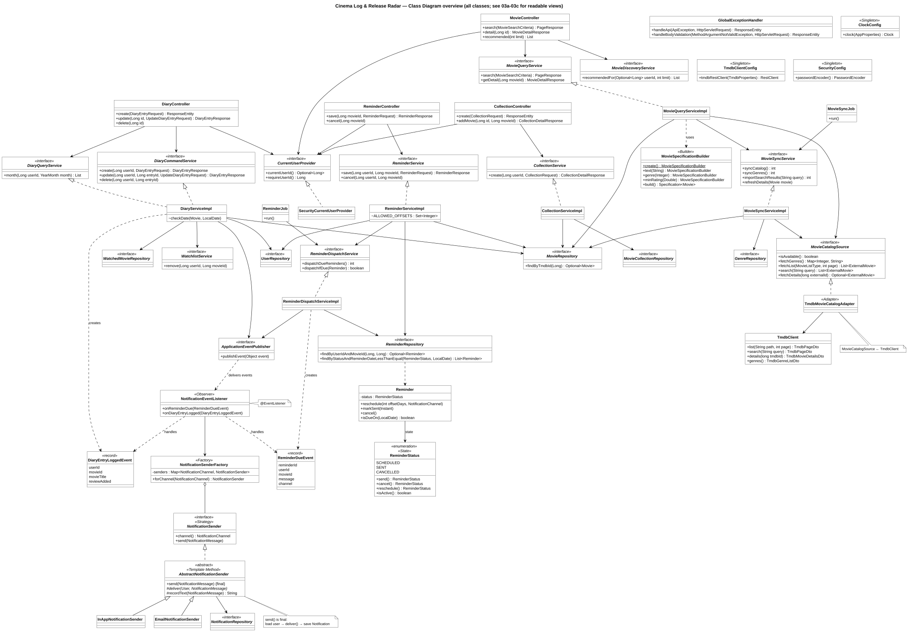

# Class diagram (layers + design pattern positions)

One vertical slice per module through every layer, with the classes that carry the design patterns.
Only the important attributes/methods are shown. Pattern details: [`../design-patterns.md`](../design-patterns.md).
Source of truth: `code/src/main/java/com/cinemalog/**`.

| Pattern | Group | Where (class / file) |
|---|---|---|
| Strategy | Behavioral | `NotificationSender` (interface) ← `InAppNotificationSender`, `EmailNotificationSender` — `service/notification/` |
| Template Method | Behavioral | `AbstractNotificationSender.send()` is `final`, subclasses implement `deliver()` and may override `recordText()` |
| Observer | Behavioral | `DiaryServiceImpl`, `ReminderDispatchServiceImpl` publish `DiaryEntryLoggedEvent` / `ReminderDueEvent` through Spring `ApplicationEventPublisher`; `NotificationEventListener` subscribes with `@EventListener` |
| State | Behavioral | `ReminderStatus` enum — each constant implements `send()`; used by `Reminder.markSent()`, `cancel()`, `reschedule()` |
| Factory | Creational | `NotificationSenderFactory.forChannel(channel)` |
| Builder | Creational | `MovieSpecificationBuilder` (`create().text().genre()…build()`), used in `MovieQueryServiceImpl.search()` |
| Singleton | Creational | `@Bean` methods `ClockConfig.clock()`, `TmdbClientConfig.tmdbRestClient()`, `SecurityConfig.passwordEncoder()` (Spring singleton scope) |
| Adapter | Structural | `MovieCatalogSource` (target) ← `TmdbMovieCatalogAdapter` (adapter) → `TmdbClient` (adaptee) |

The full diagram is split into three views so the text stays readable; every class and relationship appears in at least one view.
A class that links two views (for example `ReminderDueEvent`, `ApplicationEventPublisher`, `CurrentUserProvider`, `MovieRepository`) is repeated in both.

### 3a — Movie catalog (Adapter, Builder)

Source: [`03a-class-movie-catalog.puml`](03a-class-movie-catalog.puml) · rendered: [`03a-class-movie-catalog.svg`](03a-class-movie-catalog.svg)

### 3b — Diary, collections and notifications (Observer, Factory, Strategy, Template Method)

Source: [`03b-class-diary-notification.puml`](03b-class-diary-notification.puml) · rendered: [`03b-class-diary-notification.svg`](03b-class-diary-notification.svg)

### 3c — Reminders (State) and cross-cutting classes (Singleton beans, exception handler)

Source: [`03c-class-reminder-config.puml`](03c-class-reminder-config.puml) · rendered: [`03c-class-reminder-config.svg`](03c-class-reminder-config.svg)

### Overview (all classes in one picture)

Source: [`03-class-diagram-overview.puml`](03-class-diagram-overview.puml) · rendered: [`03-class-diagram-overview.svg`](03-class-diagram-overview.svg) — open the SVG and zoom in; use 3a–3c for reading.

`GlobalExceptionHandler` (`@RestControllerAdvice` for `controller.api`) turns every `ApiException` subclass into one JSON `ErrorResponse`: `ResourceNotFoundException` 404, `BusinessRuleException` 400, `DuplicateResourceException` 409, `UnauthorizedException` 401, `ExternalServiceException` 503.
