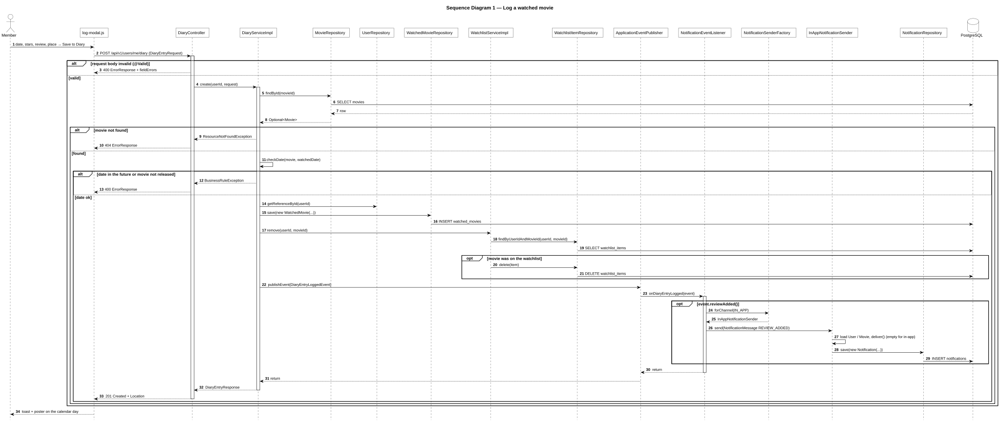
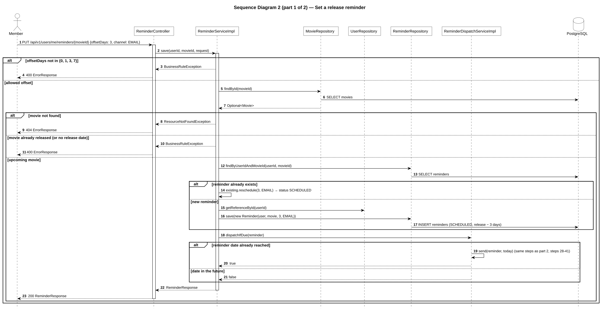
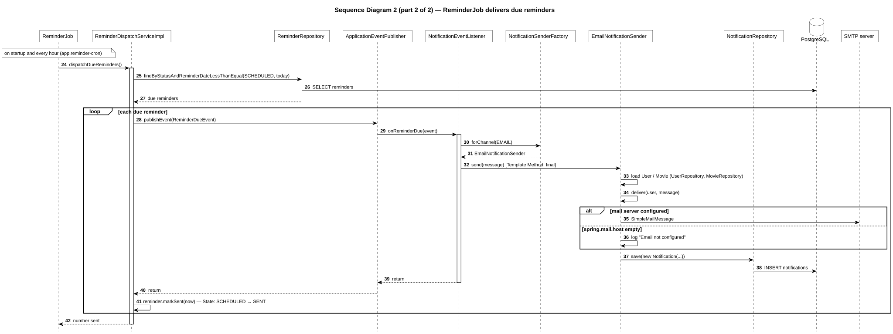
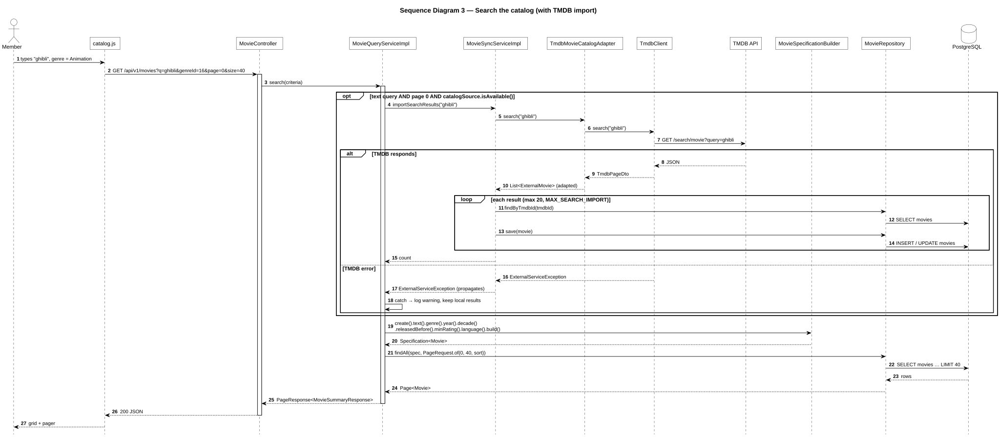

# Sequence diagrams (3 main scenarios)

Each scenario follows the real call chain Controller → Service → Repository → Database (and TMDB where used).
Spring `@EventListener` runs **synchronously** in the publisher's thread and transaction, so events are drawn as normal synchronous calls.
Source of truth: the classes named on each lifeline.

## 1. Log a watched movie ("you watched it!")

`components/log-modal.js` → `DiaryController.create()` → `DiaryServiceImpl.create()`

Source: [`04a-sequence-log-watched.puml`](04a-sequence-log-watched.puml) · rendered: [`04a-sequence-log-watched.svg`](04a-sequence-log-watched.svg)

## 2. Set a release reminder and receive it

`ReminderController.save()` → `ReminderServiceImpl.save()`; later `ReminderJob.run()` → `ReminderDispatchServiceImpl.dispatchDueReminders()`

Shown in two pictures because of its width; numbering continues from part 1 (steps 1–23) to part 2 (steps 24–42).

**Part 1 — set the reminder.** Source: [`04b-sequence-reminder-set.puml`](04b-sequence-reminder-set.puml) · rendered: [`04b-sequence-reminder-set.svg`](04b-sequence-reminder-set.svg)

**Part 2 — `ReminderJob` delivers due reminders.** Source: [`04c-sequence-reminder-dispatch.puml`](04c-sequence-reminder-dispatch.puml) · rendered: [`04c-sequence-reminder-dispatch.svg`](04c-sequence-reminder-dispatch.svg)

## 3. Search the catalog (with TMDB import)

`pages/catalog.js` → `MovieController.search()` → `MovieQueryServiceImpl.search()`

Source: [`04d-sequence-search.puml`](04d-sequence-search.puml) · rendered: [`04d-sequence-search.svg`](04d-sequence-search.svg)

