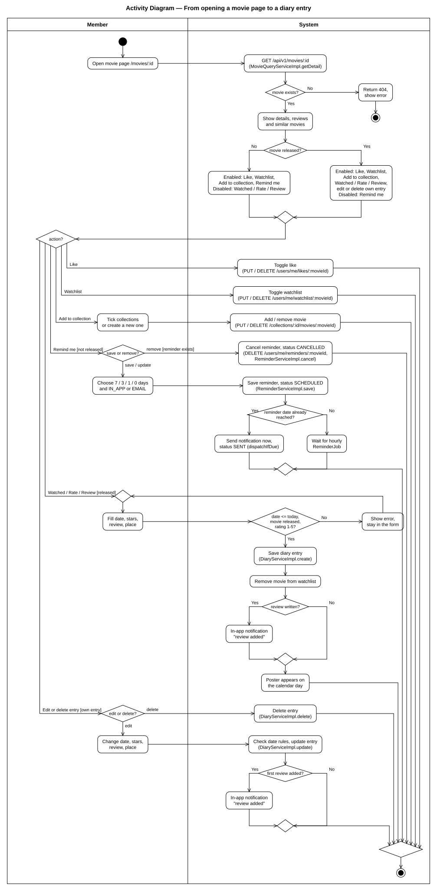

# Activity Diagram — ตั้งแต่เปิดหน้าหนังจนบันทึกลง Diary

UML activity diagram ที่มีสอง swimlane (**Member** / **System**) ประกอบด้วย initial node, action, decision node และ merge node พร้อม guard, ลูปตรวจสอบข้อมูล และ final node
ไฟล์ต้นฉบับ: [`src/05_activity.py`](src/05_activity.py) (วาด SVG ด้วยพิกัดที่กำหนดไว้ตายตัวเพื่อไม่ให้เส้นตัดกัน ให้รัน `python3 src/05_activity.py` ในโฟลเดอร์นี้) · รูปที่ render แล้ว: [`05-activity-diagram.svg`](05-activity-diagram.svg)

| ขั้นตอนในแผนภาพ | อยู่ตรงไหนในโค้ด |
|---|---|
| โหลดข้อมูลหนัง ถ้าไม่พบให้ตอบ 404 | `MovieQueryServiceImpl.getDetail()` → `ResourceNotFoundException` |
| เปิด / ปิดปุ่มตามสถานะการฉาย | `static/js/pages/movie.js` (ปุ่ม Watched / Rate / Review จะเป็น `off` เมื่อหนังยังไม่ฉาย ส่วนปุ่ม Remind me จะเป็น `off` เมื่อหนังฉายแล้ว) |
| กด Like / Watchlist สลับเปิดปิด | `LikeController`, `WatchlistController` (`PUT` / `DELETE`) |
| เพิ่มลงคอลเลกชัน | `components/collect-modal.js` → `CollectionController.addMovie()` / `removeMovie()` |
| ตั้งเตือน ถ้าถึงกำหนดแล้วให้ส่งทันที | `ReminderServiceImpl.save()` → `ReminderDispatchService.dispatchIfDue()` |
| ลบการเตือน | `components/remind-modal.js` (ปุ่ม "Remove reminder" แสดงเฉพาะเมื่อมีการเตือนอยู่แล้ว) → `ReminderController.cancel()` → `ReminderServiceImpl.cancel()` |
| ลูปตรวจสอบข้อมูล | `DiaryEntryRequest` (rating ใช้ `@Min(1) @Max(5)`) + `DiaryServiceImpl.checkDate()` (วันที่ในอนาคต / หนังยังไม่ฉาย → 400) |
| บันทึก, เอาออกจาก watchlist, สร้างการแจ้งเตือน | `DiaryServiceImpl.create()` → `WatchlistService.remove()` → `DiaryEntryLoggedEvent` → `NotificationEventListener.onDiaryEntryLogged()` |
| แก้ไข / ลบรายการ | `DiaryServiceImpl.update()` (แจ้งเตือนเฉพาะตอนเพิ่มรีวิวครั้งแรก) / `delete()` |
