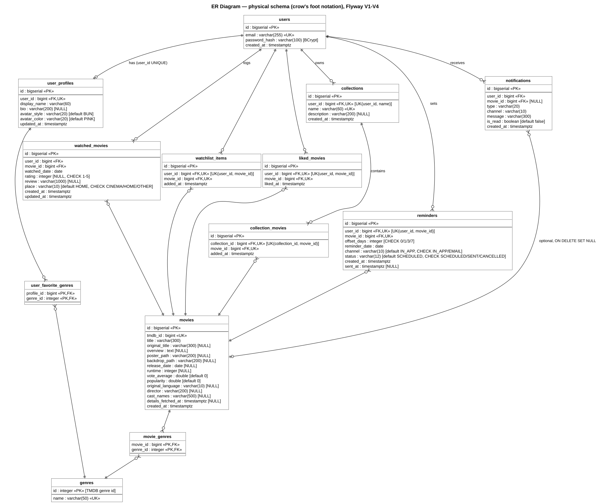
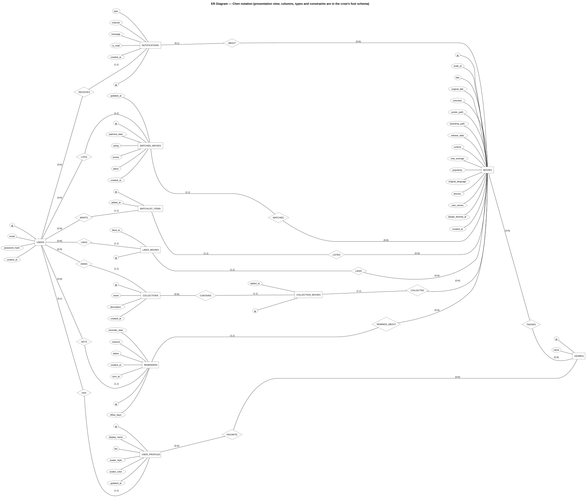

# ER diagram

Physical schema created by Flyway `V1`–`V4` (`code/src/main/resources/db/migration/`); entities in `domain/entity/` map 1:1 to these tables.
`V5`–`V7` only insert seed data. Keys: PK = primary key, FK = foreign key, UK = unique. Comments show `NULL` (optional) and checks.

### Database schema (crow's foot notation) — the detailed reference

Source: [`06-er-diagram.puml`](06-er-diagram.puml) · rendered: [`06-er-diagram.svg`](06-er-diagram.svg)

Column notes in `[...]`: `NULL` = nullable (every other column is `NOT NULL`), defaults and `CHECK` constraints. `UK(a, b)` marks a composite unique constraint.

### Chen notation — presentation view

Source: [`06-er-diagram-chen.puml`](06-er-diagram-chen.puml) · rendered: [`06-er-diagram-chen.svg`](06-er-diagram-chen.svg)

Entities are rectangles, attributes ellipses (key attribute underlined), relationships diamonds. Cardinality is written as (min,max) for each entity's participation.
Foreign-key columns are shown as relationships instead of attributes; the two pure join tables (`movie_genres`, `user_favorite_genres`) are the many-to-many relationships `TAGGED` and `FAVORITE`.
Data types, lengths, unique constraints and indexes are only in the crow's foot schema above.

**Relationships**

| Type | Tables | How it is enforced |
|---|---|---|
| One-to-One | `users` — `user_profiles` | `user_profiles.user_id` FK + `UNIQUE (user_id)`. In the database a user may have 0 or 1 profile (shown as `o|`); the app always creates both together (`AuthServiceImpl.register`) |
| One-to-Many | `users` → `watched_movies`, `watchlist_items`, `liked_movies`, `collections`, `reminders`, `notifications`; `collections` → `collection_movies`; `movies` → the same child tables | FK `ON DELETE CASCADE` (except `notifications.movie_id` → `SET NULL`) |
| Many-to-Many | `movies` — `genres` (`movie_genres`), `user_profiles` — `genres` (`user_favorite_genres`) | join tables with composite PK |
| Many-to-Many with data | `collections` — `movies` (`collection_movies`, with `added_at`) | own PK `id` + `UNIQUE (collection_id, movie_id)` |

**Unique constraints**: `uq_users_email`, `uq_user_profiles_user`, `uq_genres_name`, `uq_movies_tmdb`, `uq_watchlist_user_movie`, `uq_liked_user_movie`, `uq_collections_user_name`, `uq_collection_movie`, `uq_reminders_user_movie`.
`watched_movies` has **no** unique (user, movie): rewatches are separate diary entries.

**Indexes**: `idx_movies_release_date`, `idx_movies_popularity`, `idx_movies_vote_average`, `idx_movies_title_lower`, `idx_movie_genres_genre`, `idx_watched_user_date`, `idx_watched_movie`, `idx_collection_movies_movie`, `idx_reminders_due (status, reminder_date)`, `idx_notifications_user_created`.
