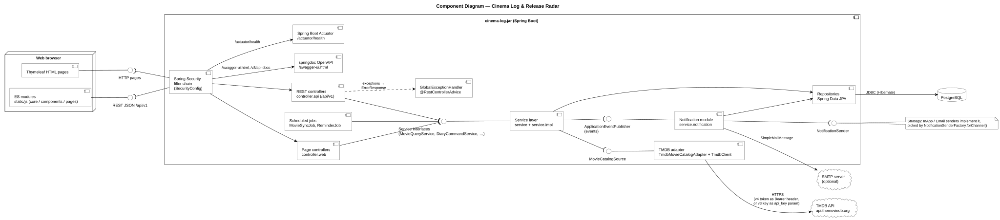
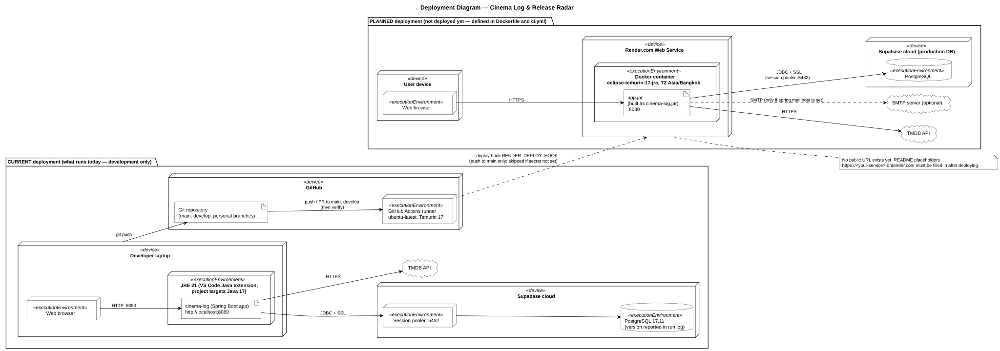

# Component Diagram และ Deployment Diagram

ทั้งสองแผนภาพเป็น UML ที่เขียนด้วย PlantUML เนื่องจาก GitHub แสดง PlantUML ไม่ได้ จึง commit ไฟล์ต้นฉบับ `.puml` คู่กับไฟล์ `.svg` ที่ render แล้ว

## Component Diagram

ไฟล์ต้นฉบับ: [`07-component.puml`](07-component.puml) · รูปที่ render แล้ว: [`07-component.svg`](07-component.svg)

| Component | Package / คลาสในโค้ด |
|---|---|
| Spring Security filter chain | `config/SecurityConfig` (ล็อกอินด้วยฟอร์มแบบ session; การเรียก `/api/**` ที่ยังไม่ได้ล็อกอินจะได้ `401` พร้อม body ว่าง ผ่าน `HttpStatusEntryPoint`) |
| Page controller | `controller/web/*PageController`, `CurrentUserModelAdvice` |
| REST controller | `controller/api/*Controller` (`/api/v1`) |
| GlobalExceptionHandler | `exception/GlobalExceptionHandler` (`@RestControllerAdvice` สำหรับ `controller.api`) |
| Service layer (interface ที่ให้บริการ) | `service/*Service` ← `service/impl/*ServiceImpl` |
| งานที่ตั้งเวลาไว้ (scheduled job) | `service/job/MovieSyncJob`, `service/job/ReminderJob` (`@Scheduled`) |
| interface `MovieCatalogSource` / TMDB adapter | `service/external/MovieCatalogSource` ← `service/external/tmdb/TmdbMovieCatalogAdapter` → `TmdbClient` |
| Event (`ApplicationEventPublisher`) / โมดูล Notification | `domain/event/*Event` → `service/notification/NotificationEventListener` |
| interface `NotificationSender` | `service/notification/NotificationSender` ← `AbstractNotificationSender` ← `InApp…` / `Email…NotificationSender` เลือกโดย `NotificationSenderFactory` |
| Repository | `repository/*Repository` (Spring Data JPA) |
| springdoc | `config/OpenApiConfig`, `/swagger-ui.html` |
| Actuator | `management.endpoints.web.exposure.include: health` ใน `application.yml` → `/actuator/health` |

## Deployment Diagram

ไฟล์ต้นฉบับ: [`07-deployment.puml`](07-deployment.puml) · รูปที่ render แล้ว: [`07-deployment.svg`](07-deployment.svg)

- **ปัจจุบัน** — แอป**ยังไม่ได้** deploy จริง ตอนนี้รันแค่บนโน้ตบุ๊กของนักพัฒนา (`http://localhost:8080`) โดยต่อกับฐานข้อมูล Supabase PostgreSQL ของทีม (log ตอนรันแสดงเป็น PostgreSQL 17.11; JRE 21 มาจาก Java extension ของ VS Code — ตัวโปรเจกต์กำหนดเป็น Java 17 ใน `pom.xml`) ผ่าน session pooler (port 5432, SSL) ส่วน GitHub Actions (`.github/workflows/ci.yml`) จะ build และรันเทสต์เมื่อมีการ push / PR ไปที่ `main` และ `develop`
- **ที่วางแผนไว้** — อ้างอิงจาก `Dockerfile` (build ด้วย `maven:3.9-eclipse-temurin-17`, รันด้วย `eclipse-temurin:17-jre`, คัดลอก `cinema-log.jar` ไปเป็น `/app/app.jar`, port 8080, `TZ=Asia/Bangkok`) และ job `deploy` ใน `ci.yml` (เรียก `RENDER_DEPLOY_HOOK` เมื่อ push ไปที่ `main` และข้ามไปถ้ายังไม่ได้ตั้ง secret) ตอนนี้ยังไม่มี URL สาธารณะ
- `docker-compose.yml` (app + `postgres:16-alpine`) เป็นทางเลือกสำหรับรันในเครื่อง และไม่ได้อยู่ในมุมมองใดของแผนภาพ
