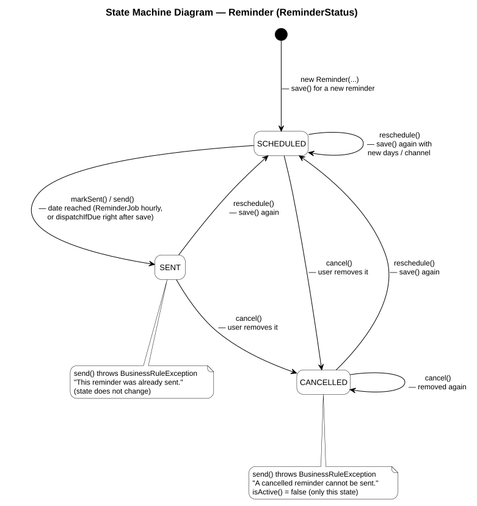

# State Diagram — Reminder

สร้างด้วย enum `ReminderStatus` (State pattern) และถูกใช้โดย `Reminder` (`domain/entity/Reminder.java`)
ค่าคงที่แต่ละตัวเป็นผู้ตัดสินว่า `send()`, `cancel()` และ `reschedule()` จะคืนค่าอะไร

ไฟล์ต้นฉบับ: [`08-state-diagram.puml`](08-state-diagram.puml) · รูปที่ render แล้ว: [`08-state-diagram.svg`](08-state-diagram.svg)

| การเปลี่ยนสถานะ | โค้ด |
|---|---|
| สร้างใหม่ → SCHEDULED | constructor ของ `Reminder` เรียก `reschedule(...)`; `ReminderServiceImpl.save()` เมื่อยังไม่มี reminder อยู่ |
| SCHEDULED → SENT | `ReminderDispatchServiceImpl` → `reminder.markSent(now)` → `status.send()`; จะส่งเฉพาะ reminder ที่ `isDueOn(today)` (เป็น SCHEDULED และวันที่ ≤ วันนี้) |
| สถานะใดก็ได้ → SCHEDULED | `ReminderServiceImpl.save()` กับ reminder ที่มีอยู่แล้ว → `existing.reschedule(offsetDays, channel)` (คำนวณวันที่ใหม่และล้างค่า `sentAt` ด้วย) |
| สถานะใดก็ได้ → CANCELLED | `ReminderServiceImpl.cancel()` → `reminder.cancel()` (หา reminder ได้ทุกสถานะ ดังนั้นยกเลิกซ้ำก็ยังเป็น CANCELLED) |
| ข้อผิดพลาด | `SENT.send()` / `CANCELLED.send()` throw `BusinessRuleException` และไม่มีการเปลี่ยนสถานะ |

ไม่มี final state เพราะ reminder ทุกตัวตั้งเวลาใหม่ได้เสมอ และแอปจะลบแถว reminder ผ่าน `ON DELETE CASCADE` เท่านั้น ตอนที่ผู้ใช้หรือหนังของ reminder นั้นถูกลบ
